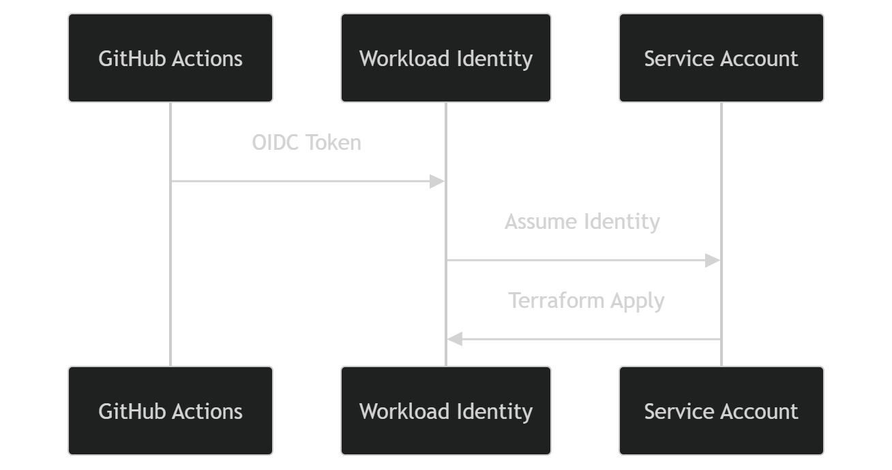

# 🧠 Deep Book OCR

GCPベースの **ドキュメントOCR → Markdown変換パイプライン**  
Document AI + Gemini を組み合わせて、PDF/画像を構造化テキストに変換します。

---

# 👤 想定ユーザー

- PDF書籍をOCR化してMarkdownとして再利用したいエンジニア
- LLMを含むサーバレスパイプラインを構築したい人
- Terraform + GitHub Actionsで運用したいチーム

---

# 🚨 重要（最初に読んでください）

本プロジェクトは **2段階構成**です。

```text
1. Bootstrap（IAM構築）※手動
2. GitHub Actions（デプロイ）※自動
```

👉 ローカルでの terraform apply は不要  
👉 GitHub Actions前提です

---

# 🎯 What is this?

```text
PDF / 画像
   ↓
Document AI（OCR）
   ↓
構造化JSON
   ↓
Markdown生成
   ↓
Gemini（任意）
   ↓
Markdown
```

補足:
- **Document AI** = GCPのOCRサービス
- **Workflows** = 複数ステップのサーバレス実行オーケストレーター

---

# 🚀 Why

- OCR結果をそのまま使えない問題を解決
- Markdownで再利用可能
- LLMで整形可能
- フルサーバレス

---

# 🏗 Architecture


### Components

| Component | Role |
| --- | --- |
| ocr-trigger | GCSイベントを受けてDocument AI OCRを開始 |
| docai-monitor | OCR完了までポーリングし、完了後に Pub/Sub へ MD ジョブを投入 |
| md-generator | Pub/Sub ジョブを受けてMarkdownを生成（必要に応じGeminiで整形） |

---

# 🔐 Bootstrap（IAM）

GitHub ActionsからTerraformを安全に実行するための **認証基盤（OIDC / WIF）** を作成します。

### なぜ必要？

- GitHub Actions から GCP へ鍵レス認証するため
- 長期JSONキーを配布せずに運用するため

### 作成されるリソース

- Workload Identity Pool（GitHub OIDCトークンの受け皿）
- Workload Identity Provider（GitHubリポジトリを信頼する設定）
- Service Account（GitHub Actions が Terraform 実行時に利用）
- IAM Binding（Provider から Service Account へのなりすまし許可）
- Terraform state 用 GCSバケット（`infra` のbackendで利用）

### 作成結果の確認（bootstrap apply後）

```bash
cd bootstrap
terraform output workload_identity_provider_name
terraform output github_actions_service_account_email
terraform output tfstate_bucket_name
```

上記の出力値を、GitHub Secrets の `WIF_PROVIDER` / `WIF_SERVICE_ACCOUNT` / `TFSTATE_BUCKET` に設定します。

```bash
cd bootstrap
terraform init
terraform apply -var-file=terraform.tfvars
```

---

# 🔑 GitHub Secrets

- GCP_PROJECT_ID
- GCP_REGION
- TFSTATE_BUCKET
- WIF_PROVIDER
- WIF_SERVICE_ACCOUNT
- GEMINI_API_KEY

---

# 🚀 Deploy

```bash
git push origin main
```

---

# 📥 Usage

`<INPUT_BUCKET>` は Terraform output で取得します。

```bash
cd infra
terraform output input_bucket_name
gsutil cp sample.pdf gs://<INPUT_BUCKET>
```

---

# 📤 Output

`<OUTPUT_BUCKET>` は Terraform output で取得します。

```bash
cd infra
terraform output output_bucket_name
gsutil ls gs://<OUTPUT_BUCKET>
```

---

# ⚙️ GitHub Actions

このプロジェクトは `.github/workflows/terraform-infra.yml` により以下を自動実行します。

- Terraform plan/apply
- Cloud Functions Gen2 / Workflows / IAM の更新
- Secret Manager への Gemini API キー同期

### Flow

`push → OIDC認証 → Terraform apply → GCP構築`

---

# 🔐 OIDC Flow



---

# ❗ Design Philosophy

- Geminiは後処理（必須ではない）
- Markdown生成（OCR JSON → 構造復元）が主処理
- Gemini失敗時は fallback で処理継続

```text
Gemini失敗 → fallback → success
```

---

# 📊 Logging

### md-generator 失敗

```text
resource.type="cloud_run_revision"
resource.labels.service_name="md-generator"
jsonPayload.stage="failed"
```

### fallback発生の確認

```text
resource.type="cloud_run_revision"
resource.labels.service_name="md-generator"
jsonPayload.stage="finished"
jsonPayload.fallback_used=true
```

---

# 🔍 Troubleshooting

| 問題 | 原因 | 対策 |
| --- | --- | --- |
| GitHub Actionsで403 | IAM / WIF未設定 | `bootstrap` を実行し、Secrets (`WIF_PROVIDER`, `WIF_SERVICE_ACCOUNT`) を再確認 |
| md-generatorで500 | GeminiのRead Timeout | `infra/terraform.tfvars` の `gemini_read_timeout_sec` を延長（例: 120〜180） |
| 入力バケットが不明 | バケット名を直接書いていない | `cd infra && terraform output input_bucket_name` で取得 |
| 出力先が不明 | 出力バケット名が不明 | `cd infra && terraform output output_bucket_name` で取得 |

---

# 🧩 Limitations

- 大規模PDFは遅延
- 完全復元ではない

---

# 📈 Future

- chunk処理
- async化

---

# ⭐ Contributing

PR歓迎

---

# 📄 License

MIT
